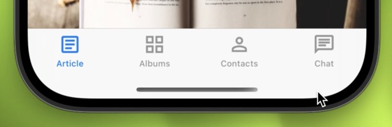
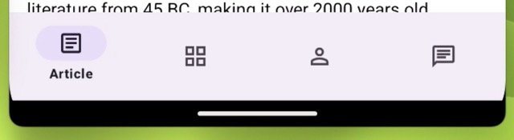
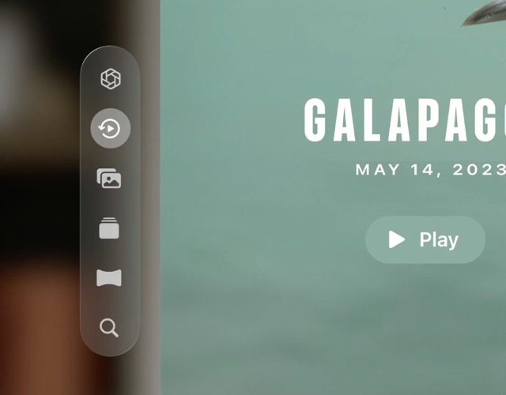

# Difference between JS Tabs and Native Tabs

React Navigation already has Bottom Tabs implementation, so you might wonder what's the difference between this project `@react-navigation/bottom-tabs`.

## Main differences

- JS Bottom Tabs recreate the UI as closely as possible while **Native Bottom Tabs use native platform primitives** to create the tabs. This makes your tab navigation indistingushable from Native Apps as they use the same components under the hood.
- Native Bottom Tabs **adapt to interfaces of a given platform** for example: tvOS and visionOS show tabs as a sidebar on iPadOS they appear at the top, while JS Bottom Tabs are always at the bottom.
- Javascript Bottom Tabs have the same apperance on Android and iOS while **Native tabs are using Material's BottomNavigationView on Android and SwiftUI's TabView on Apple platforms**.

## Distinctive features

### Animations handled by the system

Thanks to TabView being native **all tab bar animations are driven by the system** meaning there is less work for the JavaScript thread to handle making the animations smoother.

<video controls width="100%" src="https://github.com/user-attachments/assets/a2835833-9589-4fd6-b760-e73a5025ca4c" />

### Multi platform support

Native Bottom tabs adapt to platform apperance on multiple platforms. You always get natively looking tabs!

| Platform |  |
|:---:|:---:|
| **iOS** |  |
| **Android** |  |
| **iPadOS** |  |
| **visionOS** |  |
| **tvOS** |  |
| **macOS** | Coming soon |

### Automatic scroll to top

iOS TabView automatically scrolls to top when ScrollView is embeded inside of it.

No need for custom scroll to top handling.

### Sidebar Adaptable

TabView can turn in to a side bar on tvOS, iPadOS and macOS. This is controlled by `sidebarAdaptable` prop.

<video controls width="100%" src='https://github.com/user-attachments/assets/4093900f-2996-4c3a-8e15-de5b59aa53cc' />

### Smooth animations between tabs

SwiftUI's TabView offer built-in smooth animations between tabs.

### Out of the box support for Haptic Feedback

Using one prop you can add haptic feedback support to your tab bar on both Android and iOS. This can significantly enhance users experience.

## When to use JS Bottom Tabs

Using native components enforce certain constraints that we need to adapt to.

Here are few cases in which you should use JS Tabs:

- If you want a totally custom tab bar.
- If you need to render custom tab bar items.

